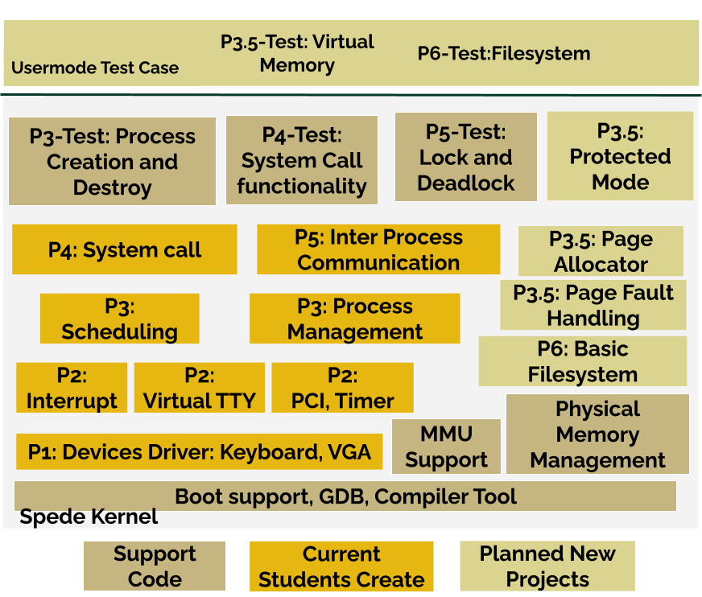
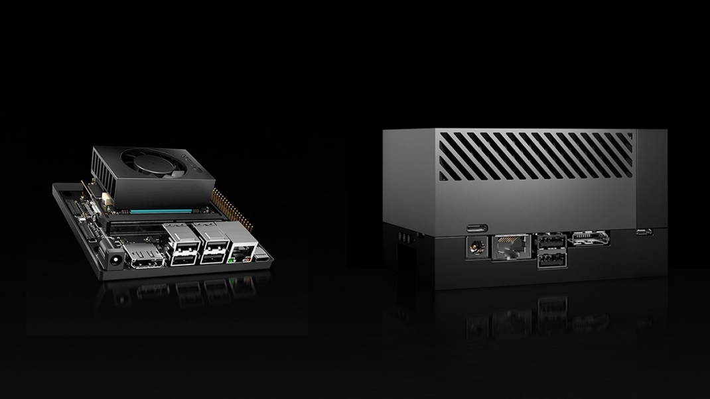



## Operating System Progmatics
  * Description
    - This project is designed to provide students with hands-on, practical experience in applying the operating system principles learned in CSC 139, ensuring they develop a solid and comprehensive understanding of the design and implementation challenges involved in modern operating system development. I am currently updating these iterative projects to align with the latest hardware advancements. The project will cover key areas such as the project environment, hardware drivers, interrupts, CPU scheduling, memory management, and file systems.

  	

  * [Project Slides](https://drive.google.com/file/d/1u6thlczTnHqV7ajLgfDGRxd-Jdrdz8lb/view?usp=sharing)
  * Hardware Simulation: QEMU (x86)
  * Cloud Platform: Chameleon Cloud
  * Software: C, Shell, Linux (Mint), GNU Compiler, KVM
  * Skills: Bash, C, make, Container
* Update
  * Sep, 25: Currently working on to asynchronous interrupt support and kernel scheduler.
  * Sep, 25: I have implemented port serials communication into Project Phase 5B. 
  * Apr, 25: I have implemented User/Kernel mode and Virtual Memory management into Project Phase 6B. 
  * Feb, 25: I rebuilt SpedeVM to Chameleoncloud (openstack/kvm) and MacAir M3 Chips (Arm64). 
  * Nov, 24: I have built a simple file system into Project Phase 6A.
  * Oct, 24: I have built a virtual memory management and user mode into Project Phase 3B.

## LLM Serving with Edge Devices
  * Description
    - The proliferation of IoT devices and the exponential growth in data generation have rendered Machine Learning (ML) training and serving systems at the network edge of paramount importance. The deployment of ML models at the edge offers real-time decision-making, minimized latency, enhanced data privacy, and localized intelligence. However, the limited computational power, memory, and constrained energy budgets on edge devices hinder the deployment of sophisticated ML models, particularly large language models.
    - This research focus on developing system and middleware solutions for exploiting the ability of edge computing for ML model serving systems and distributed model training frameworks.
  
  * Specifications:
    * Hardware: Jetson Orin Nano x3 
    * Software Stack: KServe, Kubernetes, Container
    * Skills: Serverless, Python, Large Language Model
  * Update
    * I am playing vllm serving system right now. 

## Semi-decentralized Serverless Edge Stream processing at the Edge Network
  * Description
    - The rapid growth of Internet of Things (IoT) devices has amplified the demand for real-time stream processing at the network edge, a critical enabler for smart cities, self-driving cars, online gaming, virtual reality, and augmented reality. However, existing edge stream processing systems and Kubernetes infrastructures rely on centralized management, creating bottlenecks in scalability, fault tolerance, and resource efficiency.
    - This project proposes a heterogeneous serverless edge stream processing engine to address these challenges by leveraging the Function-as-a-Service (FaaS) model. The engine supports diverse distributed edge applications, such as edge AI and media streaming, through a semi-decentralized and scalable architecture.

      

  * Specifications:
    * Hardware: Rapberry Pi 5 (x10)/ Jetson Orin Series (x3) / Chameleon cloud
    * Operating System: Ubuntu
    * Software Stack: Microk8s/Kubernetes, Container, StreamCV, Apache Flink, OpenCV, Pytorch
    * Skills: Bash, Java, C++, Python

