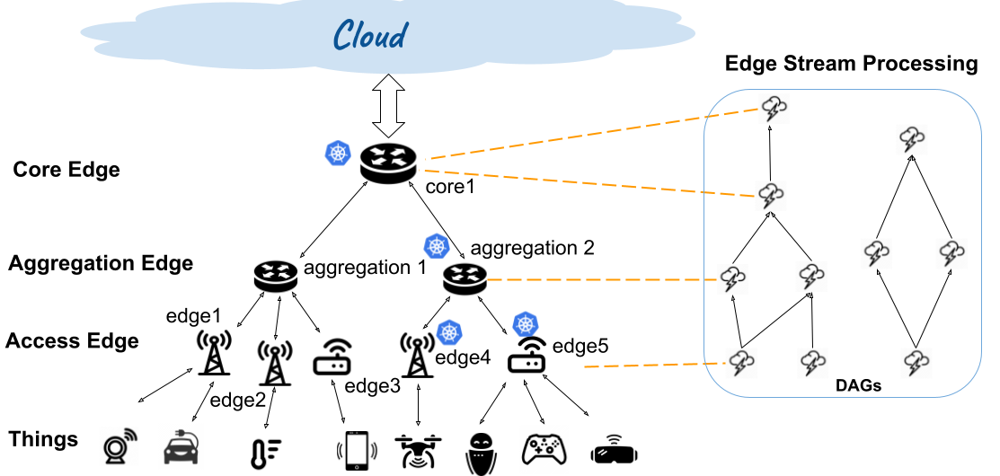



* Edge Stream Processing for Machine Learning Applications
  - Description:
    * sfa
  - Hardware: Jetson Orin
  - Operating System: Ubuntu
  - Software Stack: Microk8s/Kubernetes, Container, StreamCV, Apache Storm, OpenCV, Pytorch
  - Skills: Bash, Java, C++, Python
  

* Operating System Progmatics with real hardware
  - Hardware architecture: x86/Arm64
  - Hardware: Raspberry
  - Software: Qemu, C, Shell, Virtualbox, Virtual Machine
  - Skills: Bash, C

